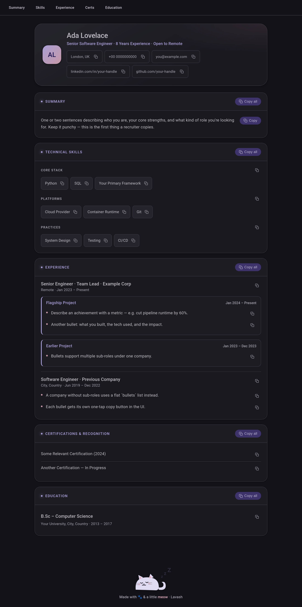

# 🐾 Lavash

> *A cozy little resume den — purr-fectly copy-paste ready.*

Lavash is a locally-hosted resume reference app. It serves all your resume
details in a clean **Material You** dark UI with one-tap copy buttons, so
filling out job applications from your laptop *or* your phone is quick and
painless. A sleepy cat may or may not be involved. 😸



> *Shown with the bundled `resume.example.yaml` sample data.*

## ✨ Features

- 🎨 **Material You (M3) dark theme** — tonal violet palette, state layers, expressive shape
- 📋 **Copy everything** — per-field *and* per-section copy buttons (name, email, each skill, each bullet…)
- 📱 **Responsive** — works great on the couch (phone) or the desk (laptop)
- 🌐 **LAN-accessible** — run it on one machine, reach it from any device on your home network
- 🔤 **Offline fonts** — Roboto bundled locally, no CDN needed
- 🐱 **Kawaii cats** — because a resume tool should still spark joy

## 🐈 Getting Started

```bash
npm install
npm start
```

Then open the URL it prints:

```
Resume app running:
  Local:   http://localhost:3000
  Network: http://<your-lan-ip>:3000   ← open this one on your phone
```

## 🍽️ Feeding the Cat (editing your data)

Your personal data lives in two **gitignored** files, so nothing about you ever
gets committed. Copy the templates once:

```bash
cp data/resume.example.yaml   data/resume.yaml          # your career info
cp data/contact.local.example.yaml data/contact.local.yaml   # phone + email
```

Then edit `data/resume.yaml` (and `data/contact.local.yaml`) and just
**refresh the browser** — the server re-reads the files on every request, no
restart required. Contact details from `contact.local.yaml` are merged into the
header at runtime. 🐾

## 🧶 Project Structure

```
lavash/
├── server.js            # Express: static serving + GET /api/resume
├── data/
│   ├── resume.example.yaml         # template → copy to resume.yaml (gitignored)
│   └── contact.local.example.yaml  # template → copy to contact.local.yaml
└── public/
    ├── index.html
    ├── styles.css       # Material You theme + cats
    ├── app.js           # renders sections, wires copy buttons
    └── fonts/           # bundled Roboto (Apache 2.0)
```

## 🐾 License

Personal project. Roboto font is under the Apache License 2.0.

---

<sub>Made with a little **meow**. If you got this far, go pet a cat. 🐱</sub>
